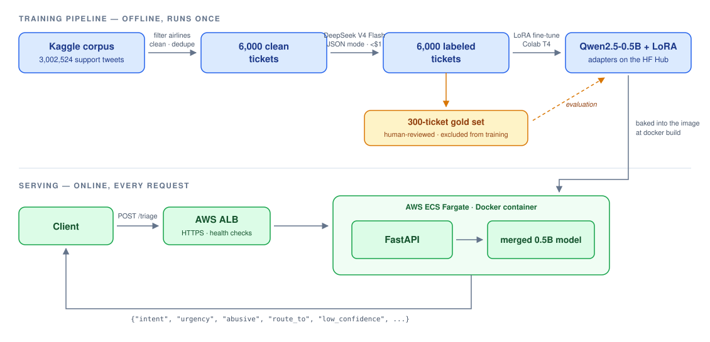
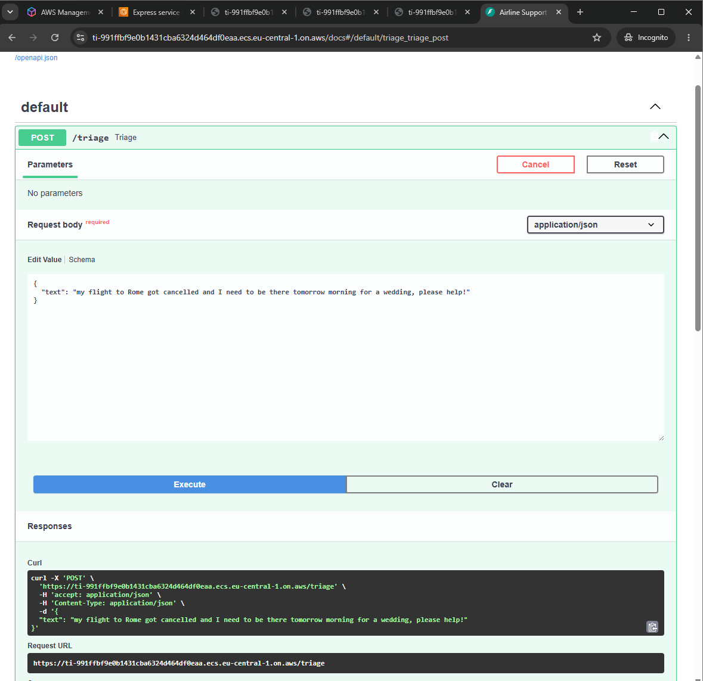
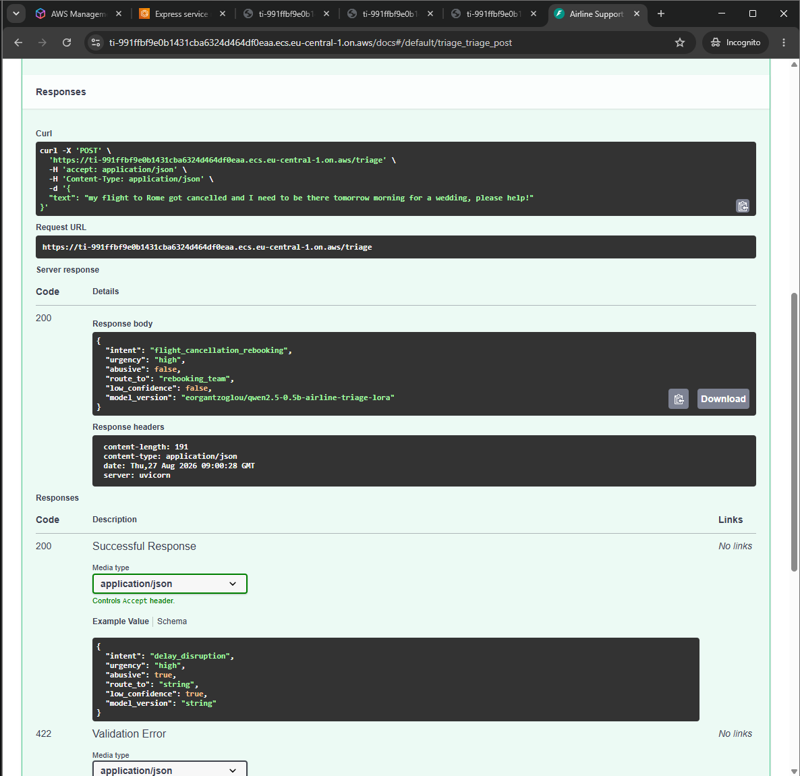
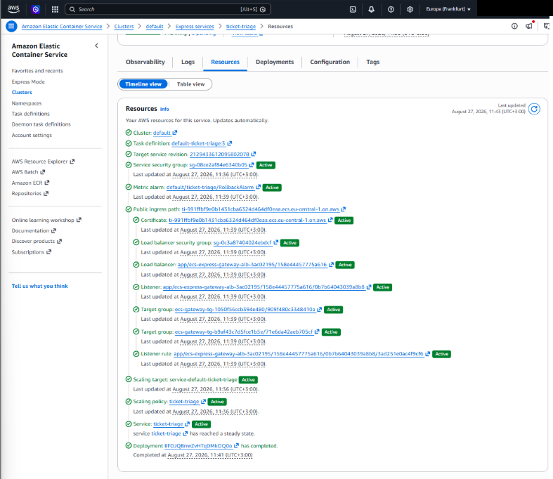

<!-- DRAFT από τον mentor, 2026-08-26. Διάβασέ το, άλλαξε ό,τι δεν σε εκφράζει,
     συμπλήρωσε τα [TODO], και σβήσε αυτό το σχόλιο πριν το repo γίνει public. -->

# Smart Support Ticket Triage

Classifies real airline customer-support messages by **intent** (10 classes),
**urgency** (3 levels), and an **abuse flag** — and routes them to the right team.
Labels are produced by an LLM API with schema-validated outputs, audited against a
hand-labeled gold set, then distilled into a fine-tuned 0.5B model that runs locally
for free.

Built end-to-end from a public 3M-message corpus: taxonomy design → LLM-assisted
labeling → human audit → LoRA fine-tuning → serving.

## Architecture



## Results

**How good are the LLM labels?** A random sample of 300 tickets was human-reviewed
with a purpose-built terminal annotation tool ([review_gold.py](src/labeling/review_gold.py)),
then adjudicated against the written taxonomy. Model–human agreement
(reproduce with `uv run src/labeling/agreement.py`):

| Axis | Agreement |
|---|---|
| Intent (10 classes) | **97.7%** (293/300) — no class below 95% |
| Urgency (3 levels) | **92.3%** (277/300) |
| Abusive flag | **100%** (300/300) |

**Can a 0.5B model learn the same job?** Qwen2.5-0.5B-Instruct, LoRA (r=16, α=32,
adapters on all linear layers), 2 epochs on 5,130 training examples — the 300 gold
tickets were excluded from training entirely. Evaluated on the gold set against
*human* labels:

| | DeepSeek V4 Flash (zero-shot) | Qwen2.5-0.5B + LoRA |
|---|---|---|
| Intent accuracy | 97.7% | 73.0% |
| Intent macro-F1 | — | 0.645 |
| Urgency accuracy | 92.3% | 80.0% |
| Valid JSON | 300/300 | 300/300 |
| Cost | ~$0.14/$0.28 per MTok (API) | free, runs locally |
| Latency | ~1.2 s/request (API, incl. network) | ~2.5 s/request (plain CPU) |

Fine-tuned adapters: [eorgantzoglou/qwen2.5-0.5b-airline-triage-lora](https://huggingface.co/eorgantzoglou/qwen2.5-0.5b-airline-triage-lora) on the HuggingFace Hub.

The zero-shot 0.5B baseline produced valid JSON but classified essentially
everything as `general_question` — the entire classification ability is the LoRA's.
Errors concentrate in the rare classes (`special_assistance`: F1 0.29 from only
121 training samples), while frequent classes do well (praise 0.91, delay 0.83,
lost luggage 0.80) — class imbalance in practice.

## Technical decisions

- **LLM-assisted labeling over hand-labeling:** 6,000 tickets labeled for <$1 and
  audited with a 300-item gold set — measuring quality instead of assuming it.
- **API over local 35B:** the original plan (Qwen 35B via Ollama) hit GPU
  out-of-memory limits; DeepSeek's OpenAI-compatible API cost less than $1 for the
  whole corpus. The classic build-vs-buy trade, decided by measurement.
- **Client-side validation:** DeepSeek offers JSON mode but no server-side schema,
  so every response passes a strict Pydantic model; malformed responses are retried
  with increasing temperature to escape deterministic failures.
- **Urgency is a *time* criterion, not severity** (plus a health/medication
  exception) — written explicitly into [the taxonomy](docs/taxonomy.md) because
  human annotators drift toward judging anger instead of time pressure.
- **Gold set hygiene:** the 300 human-reviewed tickets never enter training —
  they exist only to measure, first the labeler, then the fine-tuned model.
- **0.5B, not bigger:** small enough to fine-tune on a free Colab T4 and serve on
  CPU; the comparison table above quantifies exactly what that size costs in accuracy.
- **ECS Fargate, not App Runner:** the original deployment target (App Runner)
  stopped accepting new customers in April 2026, mid-project. The deployment
  pivoted to AWS's recommended successor — ECS Express Mode (Fargate + ALB) —
  same container, different orchestrator; the image itself needed zero changes.

## Deployment

The whole service ships as a self-contained Docker image — CPU-only PyTorch and
the merged model weights are baked in at build time (3.4 GB, 1.14 GB
compressed), so the container needs no network access and no secrets to serve.
It was pushed to a private ECR registry and deployed on **AWS ECS Fargate**
(Express Mode: application load balancer, HTTPS, health checks on `/health`,
2 vCPU / 4 GB, eu-central-1):





The deployed API classified live requests correctly over the public internet
(~4.4 s/request on 2 Fargate vCPUs). The service was then torn down to keep the
footprint at zero — the ECR image redeploys in minutes when a live demo is
needed.

<details>
<summary>AWS resources provisioned by the deployment</summary>



</details>

Known limitation, stated on purpose: the fine-tuned model cannot reliably detect
the abuse flag — only 10 of 6,000 training examples were abusive. In production
this signal would come from a separate rule-based or moderation layer, not the
intent classifier.

## Repository layout

```
src/preprocessing/clean.py     raw corpus → 6,000 clean tickets (one command)
src/labeling/schema.py         the Pydantic gatekeeper (Literal intents/urgency)
src/labeling/labeler.py        prompt assembly + validated, retrying API calls
src/labeling/label_all.py      resumable full-corpus labeling run
src/labeling/review_gold.py    terminal annotation tool for the human audit
src/labeling/agreement.py      model-vs-human agreement report
src/training/build_dataset.py  chat-format JSONL, leakage-safe train/val split
notebooks/02_finetuning.ipynb  LoRA training & evaluation (Colab)
src/api/model.py               inference: base model + LoRA adapters from the Hub, merged
src/api/app.py                 FastAPI service: /triage (validation, routing), /health
tests/test_api.py              API test suite (happy path + input contract)
docs/taxonomy.md               the label taxonomy — definitions, examples, rules
Dockerfile                     self-contained serving image (CPU torch, model baked in)
```

## Running it

```bash
uv sync                                  # install dependencies
uv run src/labeling/agreement.py         # reproduce the gold-set numbers
uv run uvicorn src.api.app:app --reload  # serve the API locally → open /docs
```

Or fully containerized (downloads the model from the HF Hub during the build):

```bash
docker build -t ticket-triage .
docker run -p 8000:8000 ticket-triage    # → http://localhost:8000/docs
```

Labeling runs need a `DEEPSEEK_API_KEY` in `.env`. Data files are not committed;
the raw corpus is [Customer Support on Twitter](https://www.kaggle.com/datasets/thoughtvector/customer-support-on-twitter) (Kaggle).
